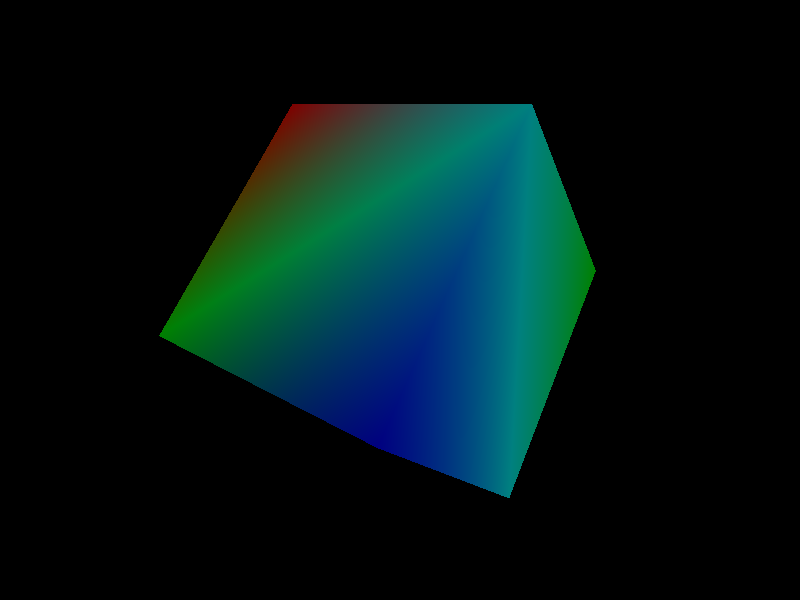
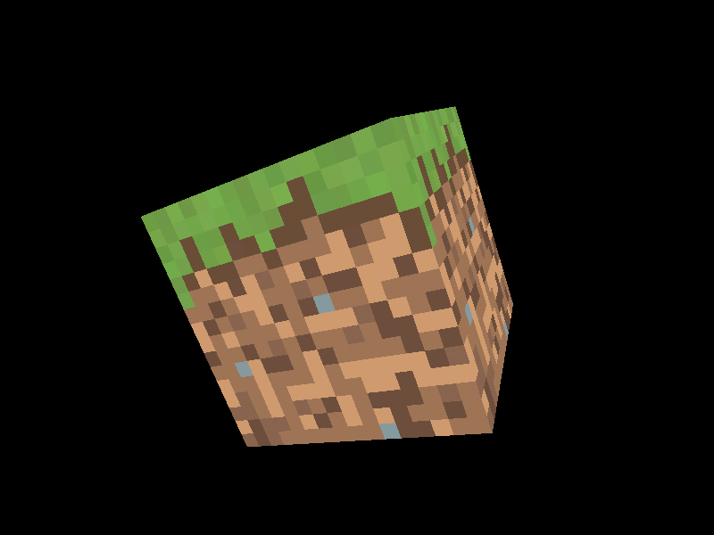

## C + OpenGL
### References
- https://lwjglgamedev.gitbooks.io/3d-game-development-with-lwjgl/content/

### Images

### Libs
- https://github.com/nigels-com/glew
- https://github.com/recp/cglm
- https://github.com/randy408/libspng
